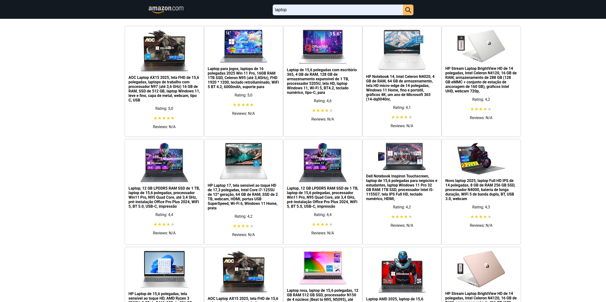
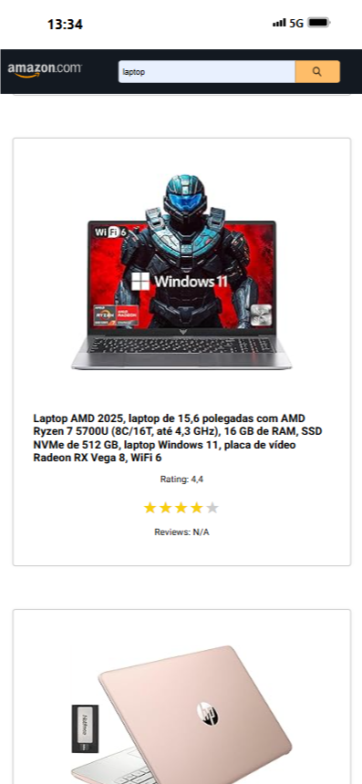

# 🛒 Amazon Scraper

Amazon Scraper is a full-stack application built with **Bun**, **Node.js**, and **Vanilla JS** (with Vite for the frontend). It allows users to search for products on Amazon by keyword and view results scraped directly from Amazon.

⚠️ This project is for educational purposes only.

---

## 🚀 Live Demo

Access the deployed version here:  
👉 **[Amazon Scraper Live](https://amazon-scraper-1-2wun.onrender.com/)**

---

## 🖼️ Screenshots

The application is fully responsive:

**🖥️ Desktop View**  


**📱 Mobile View**  


> Place your screenshots in the `assets/` folder at the root of the repository.

---

## 💻 How to Run Locally

Follow the steps below to run the project on your machine:

### 1. Clone the Repository

```bash
git clone https://github.com/your-username/amazon-scraper.git
cd amazon-scraper
